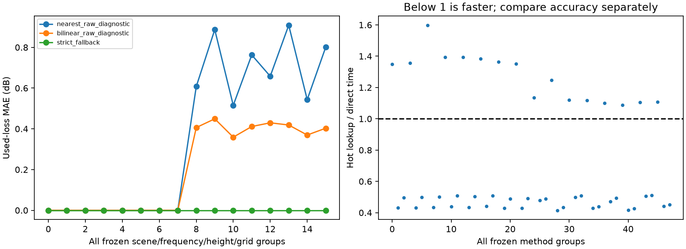

# E1 参数重组、留出方向误差与查询成本

2026-10-10，G10 实验完成，等待 Humanize Round 10 审查。G09 已通过 [Round 9 审查](direction-table-gate.md)。本报告不代表 M5/M6、E3/E4 或全计划验收。

## 设计与复现

[运行前设计](e1-design.md)、[独立分析](e1-design-review.md) 和 [冻结配置](../../configs/m2_e1.yaml) 先于数值运行。配置 SHA-256 为 `8c03c5d45e9b751709cd5ef802d15a8f6a26fddb91c875b14040161298558948`。人工平地及既有 G05 秦岭 60 m 网格，分别采用 150 m/3000 m 有限半径；两频率、两高度、两方向分辨率构成 16 张表。每张表 144 个固定留出方向均不同于两套网格采样点。

```bash
bash scripts/python_geo.sh scripts/verify_direction_cache.py --output output/m2-e1-new
bash scripts/python_geo.sh -m pytest tests -q
```

实际最终归档为 `output/m2-e1-audit-20261010`。55 个产物哈希已核对，包括原网格、来源、环境、可恢复源码、配置、缓存、逐查询、完整 M1 结果、失败检查、图表和资源记录。机器摘要见 [e1.json](e1.json)。真实输入复用本机 G05 归档；小型独立可恢复的全流程包仍属 G15。

## 分量变化与正确性

96 个因素比较行对应两场景、八种因素配置、两方向分辨率、三种查询方法。另对 16 个因素场景直接调用 M1 `calculate_links`（32 条时间记录），核对几何、FSPL、局部 raw/used/cap、增益、功率及裕量，沿用 1e-6 dB 容差。严格回退重组最大功率差为 0 dB；普通近似在因素矩阵中最大功率差为 3.359620 dB。

| 变化 | 需要更新的分量 | local 表复用 |
| --- | --- | --- |
| EIRP +10 dB | 发射功率、接收功率及裕量 | 可以；接收功率确实增加 10 dB |
| 接收方向图 | 接收增益、功率及裕量 | 可以 |
| 14.5→1 GHz | FSPL、局部绕射及预算 | 不可以，频率属于缓存身份 |
| 方向 | 局部响应、方向图响应及预算 | 同表查询新方向，按兼容性回退 |
| AGL 2→10 m | 接收几何身份、局部响应及预算 | 不可以 |
| 方向+天线、频率+高度 | 同时更新对应分量 | 遵循各自依赖 |

固定斜距为 550 km，大气损耗在所有频率下声明为恒定 1 dB，门限 −150 dBm 仅为假设诊断。方向和高度实验不冒充固定卫星 ECEF 的移动终端实验。秦岭基线 raw 为 43.358484 dB；降频后为 31.698002 dB；高度 10 m 时为 42.273147 dB。全部因素及观察到的分量变化见 [因素表](e1-factors.csv)。频率、高度、斜距、半径、步长、cap、曲率、来源和网格哈希的 36 个不兼容缓存检查全部拒绝旧身份。

## 留出误差与失败分母

共 6912 条方法查询。下表每行包含 1152 条（四个频率/高度组合×两网格×144 方向），包括所有直接回退；全部已知、无截顶、无可见性分类分歧。零截顶仅是本矩阵的观察结果，不能替代已有 cap 反例测试。

| 场景 | 查询 | used MAE (dB) | 最大绝对误差 (dB) | 直接回退数 |
| --- | --- | ---: | ---: | ---: |
| 平地 | strict | 0 | 0 | 1152 |
| 平地 | nearest | 0 | 0 | 192 |
| 平地 | bilinear | 0 | 0 | 192 |
| 秦岭 | strict | 0 | 0 | 1152 |
| 秦岭 | nearest | 0.710512 | 15.108649 | 418 |
| 秦岭 | bilinear | 0.405825 | 9.442067 | 418 |

raw 与 used 误差在此无截顶矩阵相同；固定其余预算后，功率绝对误差也相同。分组状态、近似查询子集及未截顶子集分母见 [误差表](e1-errors.csv)。没有删除失败/未知来改善分母；本次留出集恰好没有未知。地平线、无回退求解器等不可用情况保留在归档的负向检查中。

更密表不保证总误差单调下降，因为直接回退集合会变化。例如秦岭 14.5 GHz、2 m：30°→15°时回退数 56→47，nearest MAE 0.607869→0.887054 dB，bilinear MAE 0.406242→0.449081 dB。两组结果都保留，不按结果挑网格。

## 成本与结论边界

每种方法直接计算和热查询各重复五次，记录中位数与范围。表有 84 或 168 个样本，JSON 约 59.6–119.8 kB。整批运行 26.376 s，Linux 峰值 RSS 152768 KiB。详细构建、保存、加载与分组重复计时见 [成本表](e1-costs.csv) 和机器摘要。

| 场景/方法 | 热查询/直接计算中位时间比 | 冷建表盈亏平衡查询数 |
| --- | --- | --- |
| 平地 strict | 1.350–1.598 | 无有限值 |
| 秦岭 strict | 1.087–1.248 | 无有限值 |
| 平地 nearest | 0.428–0.440 | 157–582 |
| 平地 bilinear | 0.490–0.507 | 176–660 |
| 秦岭 nearest | 0.415–0.505 | 130–251 |
| 秦岭 bilinear | 0.426–0.512 | 136–255 |

Qbuild=ceil(build/(direct−query))，Qreload=ceil(reload/(direct−query))；二者分别计建表或磁盘重载，不包含一次性输入准备和保存。32 个近似组有有限 Qbuild，16 个 strict 组没有；有限 Qreload 为 5–72。这里只测局部查询成本，不能替代端到端 TLE 事件成本。



严格误差要求触发直接求解，因额外查询开销而更慢；普通近似更快但山区最大误差明显。因此本轮没有证明精度匹配的加速，也没有认可任意业务误差。固定斜距表不能直接复用于变化斜距的 TLE 轨道；有限范围、全路径未验证和服务未知语义继续保留。G12 必须在完整留出过境中单独验证事件精度与成本。

首次 `output/m2-e1-20261010` 因实验构造器漏传已冻结的 threshold basis 被 M1 拒绝，失败运行保留；补齐该必填字段后运行成功。最终 audit 运行补齐状态分母和分量变化列，未修改冻结参数或容差。全量测试 **405 passed in 9.09s**。阶段结果待 Round 10 正式审查。
