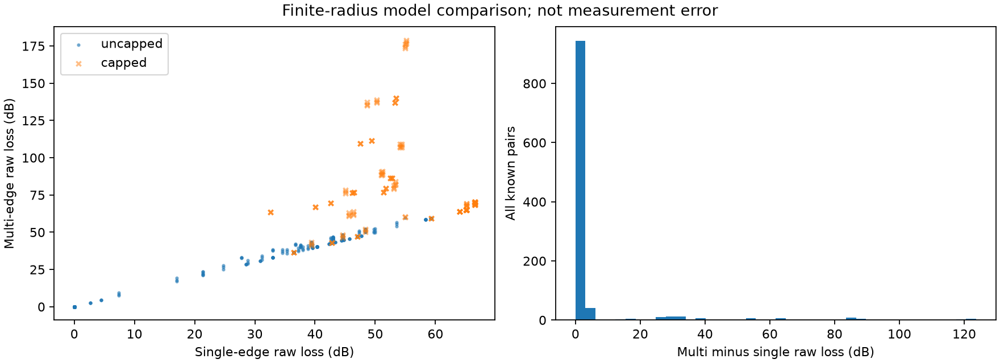
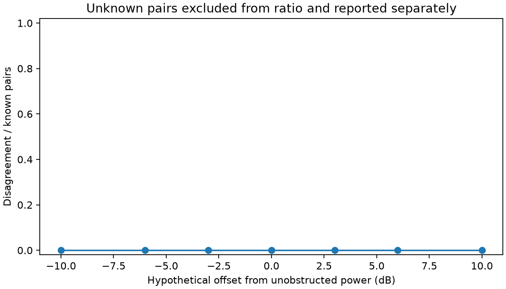
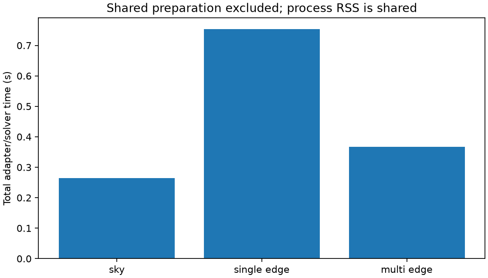

# 三角色地形比较与 E2 实验

2026-10-10，G08 已通过 [Round 8 正式复审](e2-gate.md)。Round 7 要求修复的 CSV 换行与差异检查问题已关闭，M3 原数值路径保持不变。三类角色为天空轮廓、当前主导单刀刃、独立递归多刀刃；后者只是明确变体的数值参考，不是实测真值，也不保证更准确。

规范与参数沿用运行前冻结的 [比较契约](../../docs/M4_COMPARISON_CONTRACT.md)和 [配置](../../configs/m4_e2.yaml)，没有放宽容差、改变场景或挑选有利门限。

## 实现与身份

- `engine/multi_edge.py` 独立实现固定射线轴上的主导边递归、非正分支停止、同投影最高轮廓合并、一次最终截顶。没有导入或调用 M3 损耗/驻点函数。单边公式、双边解析和 NTIA TR-26-580 表 2（约 99.86 dB，舍入容差 0.05 dB）检查通过。
- `engine/model_comparison.py` 生成三路共同输入绑定、Quantity 和有限范围功率，保留求解失败。公共剖面候选在参考内核外生成，复用 cell_intervals 和原射线驻点；因此不能声称地形或候选构造独立。M3 适配器输出与直接 TerrainContext 输出逐对象一致。
- 每组严格三角色；query_id 在指定步长变化中保持，pair_id 包含实际剖面/候选哈希、预算和参数。result_id 另绑定模型版本与源码。非法输入在求解前拒绝，单列 rejected-requests，不制造有效比较组。
- 天空角色无损耗/功率，不能将遮挡转成任意 dB；参考超点数/深度/节点预算不返回部分已知损耗。重复效应、错单位、频率/高度/源码错配、漏角色、未知填零、伪造 V1 标签等有反例测试。
- 所有条件功率保留 full_path_status=not_verified、service_eligibility=unknown、business_threshold_status=undetermined。真实输入为用户声明的 Copernicus DSM；不是裸地，拼接来源历史仍未独立重建。

## 实际运行与分母

最新归档 `output/m4-e2-lf-20261010`。完整记录含 config/environment/sources.zip、原网格及元数据、profiles.jsonl、roles.jsonl、配对差异、分组统计、全部门限、截顶、失败、同模型加密与图。六个真实网格/元数据文件均对 G05 原产物清单验证哈希。小型证据与哈希索引见 [e2.json](e2.json)。

| 范围 | 配对组数 |
|---|---:|
| 五类合成地形，基础扫描与去重后的单因素扫描 | 750 |
| 城市、山前、山区，三步长×两高度×八方位×三仰角 | 432 |
| nodata、接收点缺失、域外、地平线以下、天顶、近端、资源拒绝 | 7 |
| 合计 | 1189（3567 条角色记录） |

另 1 个频率为 0 的非法请求被拒绝并保留完整请求及 requested_roles，不计入有效配对分母。单因素值与基线完全相同时不重复计算；三步长仍完整保留。各方向为人工指定几何，真实 DEM 部分也不是 TLE 过境；时间/卫星/过境字段为有说明的 null。

天空与 M3 各有 1063 组 known、121 组 not_applicable、5 组 not_computed；多刃有 1062 组 known，另加 1 组 resource_limit。共同可计算数为 1062；其中 143 组至少一方截顶，默认未截顶统计分母为 919。M3 截顶 63 组，多刃截顶 143 组。所有失败和未知均留在总分母中。

## 差异结果与局限

差值方向均为“多刃减单刃”；天空仅进入可见性混淆表。

| 集合 | 数量 | raw MAE (dB) | raw P95 绝对差 (dB) | raw 最大绝对差 (dB) |
|---|---:|---:|---:|---:|
| 双已知且均未截顶 | 919 | 0.286607 | 2.852046 | 5.423084 |
| 上述集合且参考通过两次加密诊断 | 807 | 约 0 | 0 | 7.11e-15 |
| 至少一方截顶，另列 | 143 | 27.590819 | 88.432845 | 123.696743 |

截顶组 used 损耗 MAE=5.881937 dB，P95=17.409515 dB，最大=27.383300 dB；截顶显著压缩了 raw 差异，不能混用。原始最大差来自山区。未截顶子集内的条件功率差与损耗差方向相反，完整分场景/仰角/遮挡/频率统计见 [groups.csv](groups.csv)。

三模型在已知可见性上无分歧；资源拒绝的一组保持多刃 unknown，对应另两路 clear。−10/−6/−3/0/3/6/10 dB 七档假设门限，每档 1062 个已知配对、127 个未知/不适用配对，已知配对均为 0 次判断分歧。这个扫描未显示额外决策价值，不表示所有门限、实际业务或其他任务也无差异。





## 同模型加密与参考等级

加密表独立于三模型比较，见 [refinements.csv](refinements.csv)。参考的 401 个物理查询中：293 个通过三档步长的两次相邻 raw≤0.1 dB、LOS/cap 状态相同及全部完成检查；61 个未验证；47 个不可用。对应角色记录为 879 eligible、183 unverified、127 unavailable。只有 eligible 进入 V1 数值参考子集，全部结果仍保留。

真实城市 144 条参考记录中 135 eligible/9 unverified，山前 126/18，山区 96/48。未收敛参考不能通过改标签提升，也不能进入“已收敛参考差异”统计。0.1 dB 是预冻结数值诊断，不是业务或物理精度。离散单/双/四边解析算例另存 discrete-cases.json，属于 V0；本批没有 V2 实测。

明显的 raw 模型差异集中在截顶或加密尚未稳定的组。这也说明平地/简单视线上的一致不能外推为复杂地形参考有效；当前算法不宜用作山区实测精度认证。

## 成本与复现

本机最新运行约 8.94 s，进程峰值 RSS 416368 KiB。共用输入/候选准备约 1.649 s；角色适配/求解累计：天空 0.265 s、单边 0.753 s、多边 0.367 s。总运行还包括源码/环境归档、统计与绘图，RSS 属于整个进程；不能由此宣称多刃内核普遍更快，M3 适配器还重复构建其原生剖面以保持原接口。



```bash
bash scripts/python_geo.sh -m pip install -e '.[reports]'
bash scripts/python_geo.sh scripts/verify_model_comparison.py \
  --config configs/m4_e2.yaml --output output/m4-e2-new-run
bash scripts/python_geo.sh -m pytest tests -q
```

输出目录必须不存在。报告依赖为可选 matplotlib；本次保留 NumPy 1.26.4，matplotlib 3.11.2、contourpy 1.3.3，全部实际版本记录于 environment.json。第一次安装曾因 SOCKS 代理支持缺失失败；清理本安装进程代理后成功，并恢复被传递依赖升级的原 NumPy 基线。不是新增 RT 依赖。

最新测试 372 passed（9.26 s）；37 个产物哈希及 1189 个配对重新读取验证。初次运行 output/m4-e2-20261010 和 Round 7 的 output/m4-e2-final-20261010 均保留。Round 8 将 CSV writer 固定为 LF，使用原冻结配置重新运行，3567 条记录去除资源与源码版本字段后逐对象完全相等，分组/差异/门限/失败/加密表也完全一致。

Round 7 的“git diff check passed”记录不充分：当时工作区检查没有覆盖未跟踪 CSV，提交后检查发现 CRLF 被 Git 判为行末空白。Round 8 检查完整暂存差异及提交后 `git diff --check 9654285..HEAD`，并验证所有新归档 CSV 不含 CR。数值参数未改，旧证据未覆盖；未生成正式 reference 数据集、未改 demo。

G08 已通过审查；后续仍是 G09 方向表/缓存、G10 E1、G11–G12 条件事件/E3、G13–G14 候选决策/E4、G15–G16 全流程复现和最终验收。E2 完成不等于 AC-11 或总计划完成。
