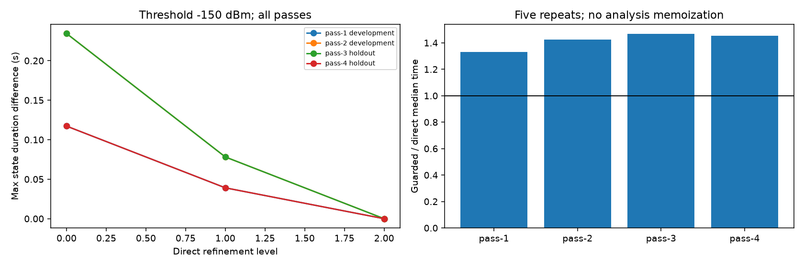

# E3 完整过境、直接时间收敛与缓存成本

2026-10-10，G12 已通过 [Round 12 审查](e3-gate.md)，包含独立的完整实验重跑。G11 软件已通过 [Round 11 审查](events-gate.md)。本实验没有证明缓存加速：现有固定斜距表在移动 TLE 链路上触发身份失效，保留直接求解后增加了开销。

## 冻结与复现

[运行前设计](e3-design.md)、[独立分析](e3-design-review.md)、[配置](../../configs/m5_e3.yaml) 与 [来源/划分](e3-design-sources.json) 先于质量实验。配置 SHA-256 为 `ca7aef2511d6cd2a65d306a32f4e7a6de258f0c26c5d94fd5fa34adf437b555a`。使用现有秦岭 60 m 网格、3 km 有限半径、15 m 区间采样、2 m AGL 和 Jan 1 NORAD 44714 TLE；14.5 GHz、EIRP 55 dBm、理想各向同性、固定大气 1 dB 都是声明假设。

按几何时间顺序取前四个完整过境，前两个开发、后两个留出，每侧加 30 秒。没有随机拆帧，也没有按质量挑选过境。以下时间为 UTC 2025-01-01：

| 过境 | 划分 | 几何起止 | 峰值仰角 |
| --- | --- | --- | ---: |
| pass-1 | 开发 | 07:48:13–07:55:11 | 4.05° |
| pass-2 | 开发 | 09:24:11–09:36:44 | 58.63° |
| pass-3 | 留出 | 11:04:30–11:15:58 | 19.04° |
| pass-4 | 留出 | 12:47:11–12:55:14 | 5.40° |

```bash
bash scripts/python_geo.sh scripts/verify_pass_events.py --output output/m5-e3-new
bash scripts/python_geo.sh -m pytest tests -q
```

实际归档 `output/m5-e3-20261010` 有 126 个产物，哈希全部核对，CSV 全部 LF。包含源码 ZIP、环境、TLE、地形/元数据、冻结配置与划分、逐时刻直接传播账本、逐方法/门限事件、参考收敛、比较、成本和图表。机器摘要见 [e3.json](e3.json)。脚本的运行前冻结检查同时依赖 Git 中的 e3-design-sources.json；该阶段归档不是 G15 自包含发行包。

## 收敛和完整分母

每个过境/门限采用 2/1/0.5 秒最大探测间隔，变化包围宽度为 0.1/0.05/0.025 秒。**12/12 组**均在这三级完成连续两次数值检查：事件数一致、匹配边界变化≤0.1 秒、累计和最长状态时长变化≤0.5 秒。未触发已预设的 0.25/0.125 秒扩展；每组均保留一个未截尾几何过境。参考是同模型直接时间加密，不是物理真值。

直接账本有 **8353** 个实际求值时刻，另有 **38228** 次仅供分析的同时间结果复用。全部源记录 computed，其中 7569 条功率已知、784 条几何不可见而功率不适用，失败 0、截顶 0。8353 个方向均不同于方向表的网格样本；留出仅限这两个完整过境，不能据此宣称跨地域或任意星座泛化。三门限以不同派生身份引用同一原始功率，未修改原传播记录。

通过逐行校验源记录身份，并从账本重建最终参考、冷直接、guarded 三类的 **36 份事件输入校验和**，确认结果引用的直接求值能够恢复。复用仅用于分析；下面的计时关闭了复用。

| 过境 | −160 dBm 足够秒数/窗口数 | −150 dBm 足够秒数/窗口数 | −140 dBm 足够秒数/窗口数 |
| --- | ---: | ---: | ---: |
| pass-1 | 0 / 0 | 0 / 0 | 0 / 0 |
| pass-2 | 450.761719 / 1 | 395.625000 / 1 | 376.132813 / 1 |
| pass-3 | 121.933593 / 2 | 70.234375 / 1 | 53.437501 / 2 |
| pass-4 | 0 / 0 | 0 / 0 | 0 / 0 |

最终参考每组约有 59.97 秒几何不可见（观察裕量）及 0.039–0.117 秒变化包围未知。累计不足、最长不足、不可见和未知均在逐事件 JSON 内单列；没有缩短观察分母。零质量窗口没有被删除，也不被写成测得零边界误差。

## 留出结果与粗采样反例

仅根据两次开发过境的全部门限，选定最粗的直接细化级别：最大探测 2 秒、变化包围 0.1 秒。该设置在六个留出门限案例中都满足冻结的诊断要求。pass-3 的已匹配质量窗口最大边界差 0.058593 秒，最大状态时长差 0.351563 秒；pass-4 没有质量窗口，其边界差不适用。

20/10/5 秒固定采样基线保留变化间隔为未知。**pass-3、−140 dBm 下，20 秒粗采样漏掉两个质量窗口**；5 秒采样恢复窗口数量，但边界差约 4.16 秒。其他 pass-3 门限的 20 秒边界差最高约 18.79 秒。所有固定步长基线在本次整体几何/质量诊断中均未合格，不能把它们的插值当作更细直接参考。

留出 guarded/direct 选定级别对参考的已知配对区间没有出现乐观或悲观分歧；这不表示全时段误差为零：每组仍有 0.156–0.469 秒至少一侧未知的时间。20 秒基线的未知配对时间可达 120 秒。完整窗口漏检、多检、边界、时长及配对分母见 [比较表](e3-comparisons.csv)。

## 成本与无收益结果

采用独立分析建议的旁路诊断：先执行原 M1，再按实际斜距调用表的身份检查。CacheMismatch 捕获后保留已有直接记录，绝不拿固定斜距近似替代移动链路。此实现测量兼容性检查和回退，不是能够省掉直接求解的通用缓存加速器。

432 样本表以首个开发观察区间中点为锚，斜距 2281345.906761 m；输入/锚点准备 0.626668 秒，建表 0.406622 秒，保存 0.017073 秒，重载 0.014059 秒，JSON 301645 bytes。

每个过境固定 101 个均匀时刻，直接和 guarded 各五次，报告中位数和范围。三门限共享同一传播计时，不能当作三份独立性能测量：

| 过境 | guarded / direct 热计时中位比 |
| --- | ---: |
| pass-1 | 1.333 |
| pass-2 | 1.423 |
| pass-3 | 1.467 |
| pass-4 | 1.452 |

冷完整过境直接耗时 2.192–4.253 秒，guarded 为 3.180–5.517 秒；共 6358 次完整事件 guarded 查询全部发生斜距身份失效。热计时中首过境的五次锚点同身份查询也因非样本精度未认证返回 fallback_required，其余 2015 次热查询身份失效，没有跳过直接求解。

12 组记录都为 **no_finite_break_even**，因为查询本身已更慢。记录中的冷预算包含准备+建表+保存，重载预算包含准备+重载；其中共同输入准备在两个方案都冷启动时应同时计入并抵消。本次查询时间差已使有限盈亏平衡不存在，结论不依赖是否抵消共同准备成本。不能由这个诊断实现推断所有未来缓存设计都无效。



详细五次计时及冷成本见 [成本表](e3-costs.csv) 和机器摘要。整批实际耗时 215.610 秒，峰值 RSS 498936 KiB。新增 4 项比较/派生身份/整过境划分测试，全量 **421 passed in 9.67s**。

当前范围仍为 3 km 内的单刀刃条件模型，外部地形未验证、服务未知、业务 allowed_event_error 未定。有限探测间隔可能遗漏更窄事件；同模型时间收敛不能取代观测验证。下一主线为 M6 候选点和隔离评价器，E4、全流程新环境复现及最终审查尚未完成。
